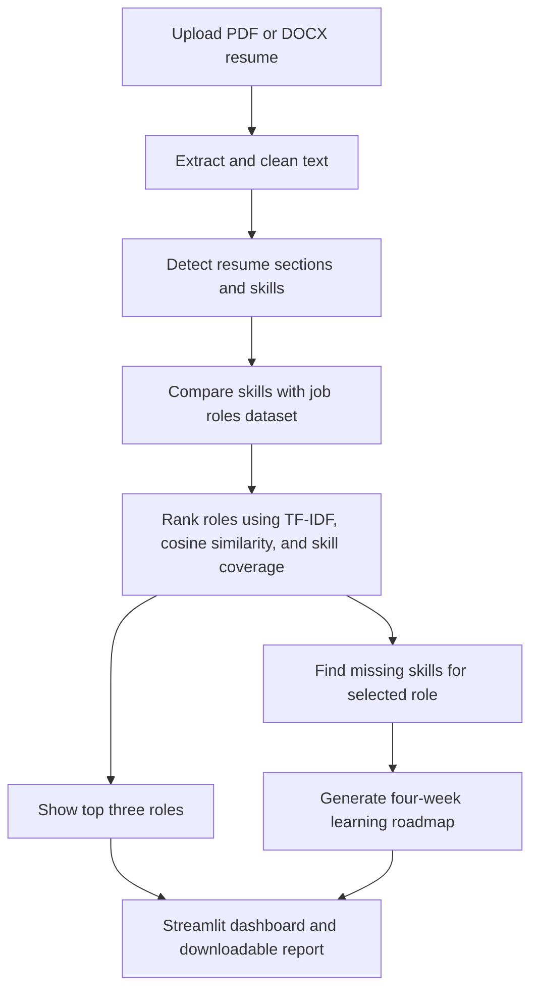

# AI Resume Analyzer Architecture

```mermaid
flowchart TD
    A["Upload PDF or DOCX resume"] --> B["Extract and clean text"]
    B --> C["Detect resume sections and skills"]
    C --> D["Compare skills with job roles dataset"]
    D --> E["Rank roles using TF-IDF, cosine similarity, and skill coverage"]
    E --> F["Show top three roles"]
    E --> G["Find missing skills for selected role"]
    G --> H["Generate four-week learning roadmap"]
    F --> I["Streamlit dashboard and downloadable report"]
    H --> I
```

The job roles and skill dictionary are stored in CSV files in the `data` folder. Uploaded resumes are analyzed in memory.