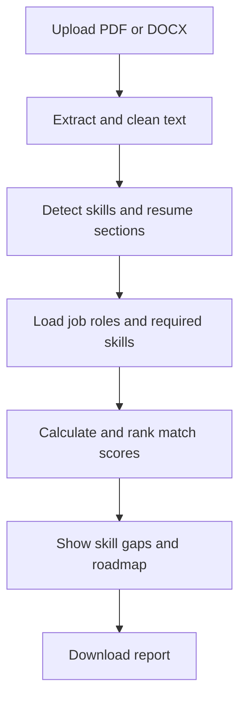

# AI Resume Analyzer and Job Recommendation System

A Streamlit application that analyzes a PDF or DOCX resume and suggests suitable job roles. It detects skills, compares the resume with five role descriptions, shows missing skills, and creates a basic learning roadmap.

## Features

- Upload PDF and DOCX resumes up to 5 MB
- Extract and clean resume text
- Detect technical skills from a controlled skill dictionary
- Identify education, projects, and experience sections
- Compare the resume with five predefined job roles
- Show match scores and the top three roles
- Show skills found and missing skills for a selected role
- Generate a learning roadmap
- Download a text analysis report

## Project workflow



## Datasets

- `data/skill_dictionary.csv` contains skill names, categories, and alternative spellings.
- `data/job_roles.csv` contains five job roles, their required skills, and descriptions.

These are small, manually prepared datasets. A labelled training dataset is not used.

## Matching method

The app detects skills using keyword and alias matching. It uses TF-IDF vectors and cosine similarity to compare resume text with each job description.

The displayed estimated score combines:

- 70% coverage of the role's listed skills
- 30% TF-IDF text similarity

A score is an estimate for career guidance, not a hiring decision.

## Requirements

- Python 3.10 or newer
- Packages listed in `requirements.txt`

## Run the application

Open a terminal in this project folder and run:

```powershell
python -m pip install -r requirements.txt
python -m streamlit run app.py
```

Open the local URL displayed in the terminal. Upload a text-based PDF or DOCX resume.

## Test files and results

Use the fictional resumes in `sample_resumes/`. The recorded checks are in `tests/test_cases.csv`.

## Privacy and limitations

Uploaded resume contents are processed for the current analysis and are not intentionally saved by this application. Avoid adding real private resumes to the public GitHub repository.

Scanned PDFs without selectable text need OCR and are not supported. Keyword matching can miss skills expressed in unfamiliar words. Section detection depends on recognizable headings. A missing keyword does not prove that a person lacks a skill. Do not use the results to automatically accept or reject job applicants.